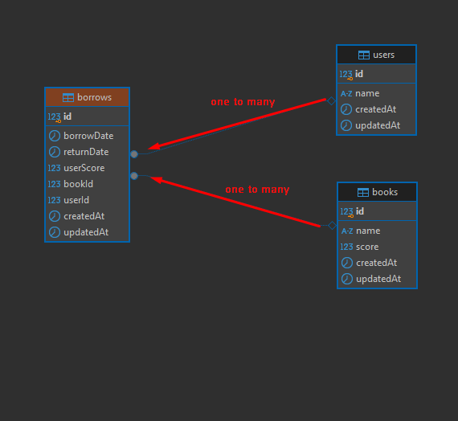

# Library Management Application

The **Library Management Application** is a system designed to streamline the management of library resources, focusing on interactions between members and books. This application enables efficient user and book management while simplifying the borrowing and returning process.

---

## Features

### 1. User Management
- List all registered users.
- View detailed user information, including:
  - Name.
  - Currently borrowed books.
  - Borrowing history with user-assigned ratings.
- Add new users to the library system.

### 2. Book Management
- List all available books in the library.
- View detailed book information, including:
  - Name.
  - Average rating based on user reviews.
- Add new books to the library system.

### 3. Borrowing and Returning
- Borrow books from the library.
- Ensure books can only be borrowed if they are not currently loaned out.
- Return books and optionally provide a rating for the book.

---

## Technical Overview

- **Backend**: Built with Node.js and Sequelize ORM for database management.
- **Database**: PostgreSQL is used to store data about users, books, and borrowing records.
- **Data Relationships**:
  - **User ↔ Borrowing**: One user can borrow many books, but a single borrow record belongs to one user.
  - **Book ↔ Borrowing**: One book can have many borrowing records, but only one active borrow at a time.
- **APIs**: RESTful APIs provide endpoints for CRUD operations on users, books, and borrowing/returning activities.  
 


## Usage

This application is designed for libraries looking to digitize their operations. It provides tools for managing users and books while maintaining a detailed borrowing history. The system is scalable and can be extended with additional features, such as:
- Advanced search capabilities.
- Automated notifications for due dates.
- Analytics for library resource usage.

---

## How to Run

1. Clone the repository:
   ```bash
   git clone https://github.com/habilyadigar/LibAppCase.git

2. Install dependencies:
   ```bash
   npm install  

3. Set up your environment variables in a .env file:
   ```bash
   PORT="3000" 
   DB_NAME=your_database_name
   DB_USERNAME=your_username
   DB_PASSWORD=your_password
   DB_HOST=your_host
   DB_PORT=your_port  

4. Start the application:
    ```bash
    npm start  

5. Access the API at:
   ```bash
      http://localhost:3000
